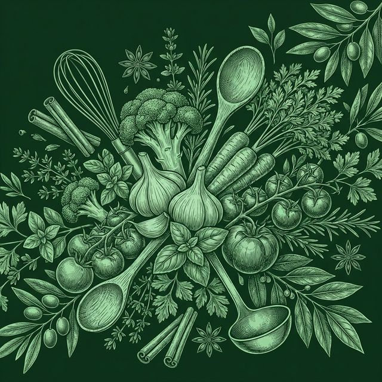

# 🍳 chefGPT — AI-Powered Recipe Generator

<div align="center">



**Transform your available ingredients into delicious, chef-crafted recipes — powered by Groq AI.**

[](https://chef-gpt-blush-seven.vercel.app)
[](https://vercel.com)
[](https://render.com)
[](LICENSE)

</div>

---

## 📖 Table of Contents

- [Overview](#-overview)
- [Features](#-features)
- [Tech Stack](#-tech-stack)
- [Project Structure](#-project-structure)
- [Getting Started](#-getting-started)
  - [Prerequisites](#prerequisites)
  - [Environment Variables](#environment-variables)
  - [Running Locally](#running-locally)
- [Deployment](#-deployment)
  - [Frontend — Vercel](#frontend--vercel)
  - [Backend — Render](#backend--render)
- [API Reference](#-api-reference)
- [Screenshots](#-screenshots)
- [Contributors](#-contributors)

---

## 🧠 Overview

**chefGPT** is a minimalist, AI-powered recipe web application. You simply type in whatever ingredients you have at home, and chefGPT uses the **Groq AI API** (running Meta's LLaMA 3.1 model) to instantly generate a complete, easy-to-follow recipe along with professional chef tips.

No accounts. No databases. No complexity — just great food ideas in seconds.

---

## ✨ Features

- 🥕 **Ingredient-based Recipe Generation** — Enter any combination of ingredients and get a full recipe
- 🤖 **Powered by Groq + LLaMA 3.1** — Lightning-fast AI inference
- 📋 **Structured Recipe Output** — Cleanly parsed sections: title, ingredients, steps, chef tips
- 🎨 **Premium Dark Green UI** — Beautiful botanical hero background, glassmorphism cards
- 📱 **Fully Responsive** — Works seamlessly on desktop, tablet, and mobile
- ⚡ **Near-instant Results** — Groq's API delivers responses in ~1–2 seconds
- 🔒 **No Auth Required** — Zero friction, open to everyone

---

## 🛠 Tech Stack

### Frontend
| Technology | Version | Purpose |
|---|---|---|
| [React](https://react.dev) | 19 | UI framework |
| [TypeScript](https://typescriptlang.org) | 5.9 | Type safety |
| [Vite](https://vitejs.dev) | 7 | Build tool & dev server |
| [React Router DOM](https://reactrouter.com) | 7 | Client-side routing |
| [Tailwind CSS](https://tailwindcss.com) | 3.4 | Utility-first styling |
| [Lucide React](https://lucide.dev) | 0.575 | Icon library |

### Backend
| Technology | Version | Purpose |
|---|---|---|
| [Node.js](https://nodejs.org) | 22 | Runtime |
| [Express](https://expressjs.com) | 5.2 | HTTP server |
| [Groq SDK](https://console.groq.com) | 0.37 | AI recipe generation |
| [CORS](https://npmjs.com/package/cors) | 2.8 | Cross-origin requests |
| [dotenv](https://npmjs.com/package/dotenv) | 17 | Environment variable management |

### Infrastructure
| Service | Purpose |
|---|---|
| [Vercel](https://vercel.com) | Frontend hosting |
| [Render](https://render.com) | Backend hosting |
| [GitHub](https://github.com) | Version control & CI/CD |
| [Groq Cloud](https://console.groq.com) | AI model API |

---

## 📁 Project Structure

```
chefGPT/
├── client/                        # Frontend (React + Vite)
│   ├── public/
│   │   └── favicon.png            # chefGPT browser tab icon
│   ├── src/
│   │   ├── assets/
│   │   │   ├── chefgpt_logo.png   # Navbar logo
│   │   │   └── hero_bg.png        # Hero section background
│   │   ├── pages/
│   │   │   ├── Home.tsx           # Landing page with ingredient input
│   │   │   ├── Recipe.tsx         # AI-generated recipe display
│   │   │   └── About.tsx          # About the app
│   │   ├── App.tsx                # Root component with routing & navbar
│   │   ├── App.css                # Global component styles
│   │   ├── index.css              # Tailwind base + global tokens
│   │   └── main.tsx               # React entry point
│   ├── index.html                 # HTML shell
│   ├── tailwind.config.js
│   ├── vite.config.ts
│   └── package.json
│
├── server/                        # Backend (Express + Groq)
│   ├── index.js                   # Express app & /api/recipe endpoint
│   ├── .env                       # ⚠️ Never commit — see env setup below
│   └── package.json
│
├── .gitignore
└── README.md
```

---

## 🚀 Getting Started

### Prerequisites

Make sure you have the following installed:

- [Node.js](https://nodejs.org) v18 or higher
- [npm](https://npmjs.com) v9 or higher
- A free [Groq API key](https://console.groq.com) — takes 30 seconds to get

---

### Environment Variables

#### Backend — `server/.env`

Create the file `server/.env` with:

```env
GROQ_API_KEY=your_groq_api_key_here
PORT=5000
```

Get your free Groq API key at → [console.groq.com](https://console.groq.com)

#### Frontend — `client/.env.local` *(only needed if backend URL changes)*

```env
VITE_API_URL=http://localhost:5000
```

---

### Running Locally

**1. Clone the repository**
```bash
git clone https://github.com/AIChoubeyX/chefGPT.git
cd chefGPT
```

**2. Start the backend**
```bash
cd server
npm install
npm run dev
# Server running on http://localhost:5000
```

**3. Start the frontend** *(in a new terminal)*
```bash
cd client
npm install
npm run dev
# App running on http://localhost:5173
```

**4. Open your browser** → [http://localhost:5173](http://localhost:5173)

---

## ☁️ Deployment

### Frontend — Vercel

1. Push your code to GitHub
2. Go to [vercel.com](https://vercel.com) → **New Project** → Import repo
3. Set configuration:
   - **Root Directory:** `client`
   - **Framework:** Vite
   - **Build Command:** `npm run build`
   - **Output Directory:** `dist`
4. Add environment variable:
   - `VITE_API_URL` = `https://your-render-backend-url.onrender.com`
5. Click **Deploy**

### Backend — Render

1. Go to [render.com](https://render.com) → **New Web Service** → Connect repo
2. Set configuration:
   - **Root Directory:** `server`
   - **Build Command:** `npm install`
   - **Start Command:** `npm start`
3. Add environment variables:
   - `GROQ_API_KEY` = `your_groq_api_key`
   - `NODE_ENV` = `production`
4. Click **Deploy**

> ⚠️ **Note:** Render's free tier spins down after 15 min of inactivity. The first request after a cold start can take ~30 seconds. Upgrade to a paid plan to avoid this.

---

## 📡 API Reference

### `POST /api/recipe`

Generates a recipe from a list of ingredients.

**Request**

```http
POST https://chefgpt-o270.onrender.com/api/recipe
Content-Type: application/json
```

```json
{
  "ingredients": "chicken breast, broccoli, garlic, olive oil, lemon"
}
```

**Response `200 OK`**

```json
{
  "recipe": "## Garlic Lemon Chicken with Broccoli\n\n### Ingredients\n..."
}
```

**Response `400 Bad Request`**

```json
{
  "error": "Ingredients are required"
}
```

**Response `500 Internal Server Error`**

```json
{
  "error": "Failed to generate recipe"
}
```

---

## 📸 Screenshots

| Page | Description |
|---|---|
| **Home** | Hero section with botanical background + ingredient input |
| **Recipe** | Structured AI-generated recipe with sections and numbered steps |
| **About** | App description and feature highlights |

---

## 👨‍💻 Contributors

Built with 💚 by the chefGPT team:

| Name | Role |
|---|---|
| **Ashutosh Choubey** | Full Stack Development & Project Lead |
| **Himanshu Varma** | Frontend Development |
| **Keshari Nandan** | Backend & API Integration |
| **Chirashree Mahato** | UI/UX Design |
| **Nandini Sarkar** | Testing & Documentation |
| **MD Aman** | Deployment & DevOps |

---

## 📄 License

This project is licensed under the **ISC License**.

---

<div align="center">

Made with 🍳 by the chefGPT team &nbsp;|&nbsp; [Live Demo](https://chef-gpt-blush-seven.vercel.app)

</div>
